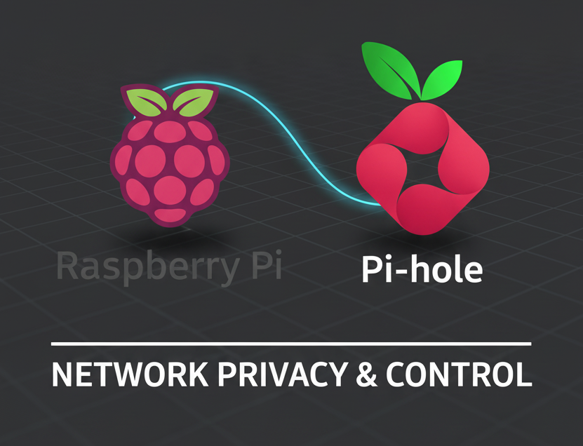
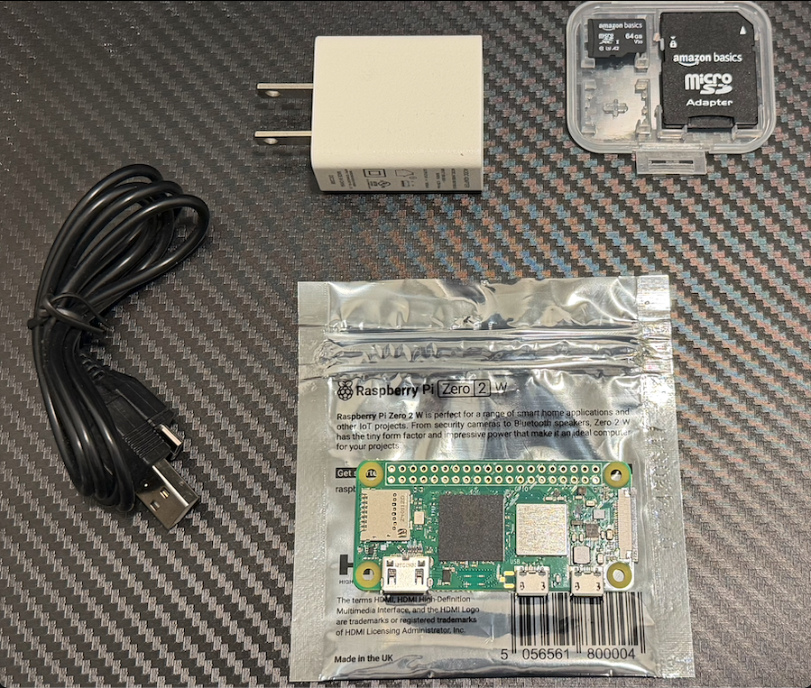

# Pi-hole Deployment on Raspberry Pi Zero 2 W
<!-- Markdown supports embedding raw HTML. This comment is HTML. The size of the initial image is controlled with HTML -->



## Overview

This project documents the setup of a **Raspberry Pi Zero 2 W** running **Pi-hole** to provide network-wide ad blocking and DNS filtering for an apartment with **~20–30 devices**.

Pi-hole acts as a local DNS sinkhole that blocks ads and trackers before they reach your devices, improving privacy, reducing bandwidth usage, and speeding up browsing.

This documentation walks you through preparing your hardware, flashing the operating system, configuring the network, and installing Pi-hole using SSH on macOS.

**Why this project?**  
A lightweight Raspberry Pi Zero 2 W running Pi-hole provides a reliable, silent, low-power privacy solution for your entire network.

---

## Project Purpose

- Deploy a **centralized DNS filtering solution**
- Improve privacy by blocking ads and trackers network-wide
- Use a **static DHCP lease** via router to keep Pi-hole’s IP consistent
- Ensure full compatibility with **Wi-Fi-only hardware**
- Provide clean, modular documentation for ease of maintenance

---

## Why Raspberry Pi Zero 2 W?

- Small form factor, ideal for 24/7 uptime.  
- Low power consumption (micro-USB powered).  
- Sufficient performance for handling network-level DNS.  
- Easy to manage remotely via SSH.

---

## Hardware List

| Item | Description |
|------|-------|
| **Raspberry Pi Zero 2 W** | Main board running the OS + Pi-hole |
| **Micro USB Cable + 5V Power Supply** | Required to power the Pi |
| **32GB MicroSD Card** | System + logs |
| **MicroSD Card Reader** | For flashing OS |
| **Computer** | To flash the OS and connect using SSH |
| **Wi-Fi Network (2.4 GHz)** | Required for Pi Zero 2 W |

Example hardware photo:  


---

## Repository Structure

```plaintext
.
├── README.md
├── images/
│   ├── pihole_overview.png
│   ├── hardware_overview.png
│   ├ ...
│   └── emergency_dns_recovery.png
├── documents/
│   ├── 01-raspberry-os-installation.md
│   ├── 02-network-configuration.md
│   ├── 03-pihole-installation.md
│   ├── 04-web-interface-and-usage.md
│   ├── 05-maintenance-and-updates.md
│   └── 06-troubleshooting.md
└── LICENSE
```

---

## Documentation Files

### 01 — Raspberry Pi OS Installation  
How to download, flash, and configure Raspberry Pi OS Lite using Raspberry Pi Imager, including user account, Wi-Fi, and SSH settings.  
*[01-raspberry-os-installation.md](documents/01-raspberry-os-installation.md)*

### 02 — Network Configuration  
Verify network connectivity, assign a static DHCP lease in the router, and confirm that the Raspberry Pi is reachable via IP and hostname.  
*[02-network-configuration.md](documents/02-network-configuration.md)*

### 03 — Pi-hole Installation  
How to install Pi-hole, choose DNS providers, and access the admin interface.  
*[03-pihole-installation.md](documents/03-pihole-installation.md)*

### 04 — Web Interface & Usage  
Walkthrough of dashboard metrics, query logs, blocklists, and whitelisting.  
*[04-web-interface-and-usage.md](documents/04-web-interface-and-usage.md)*

### 05 — Maintenance & Updates  
Updating the OS, updating Pi-hole, cleaning logs, restarting services, and checking system health.  
*[05-maintenance-and-updates.md](documents/05-maintenance-and-updates.md)*

### 06 — Troubleshooting  
Fixing DNS failures, web interface issues, emergency recovery, and more.  
*[06-troubleshooting.md](documents/06-troubleshooting.md)*

---

## Network Diagram

All DNS requests from devices flow to Pi-hole, which forwards safe queries upstream (e.g., Cloudflare DNS).

### Simple Diagram

```plaintext
          ┌──────────────┐
          │   Internet   │
          └──────┬───────┘
                 │
        (Upstream DNS: Cloudflare, etc.)
                 │
          ┌──────▼────────┐
          │   Pi-hole     │
          │ Raspberry Pi  │
          │   Zero 2 W    │
          └──────┬────────┘
                 │  (Wi-Fi)
        ┌────────┴───────────┐
        │  Home Router /     │
        │  Wi-Fi Access Point│
        └────────┬───────────┘
                 │
   ┌─────────────┼──────────────────────────────┐
   │             │                              │
┌──▼──────┐   ┌──▼────────┐           ┌─────────▼──────────-┐
│ Phones  │   │ Laptops/  │           │ Other Devices       │
│         │   │   PCs     │           │ (ex. Consoles, IoT) │
└─────────┘   └───────────┘           └─────────────────────┘
```

---

## Accessing Pi-hole

Once set up, Pi-hole’s web dashboard will be available at:

http://pi.hole:80/admin

or

http://[RPizero-Static-IP]:80/admin

---

## License

This project and documentation are released under the [MIT License](LICENSE).

---

## Credits

- [Pi-hole Project](https://pi-hole.net/)
- [Raspberry Pi Foundation](https://www.raspberrypi.com/)
- Created and documented by **Luis Morin**

---