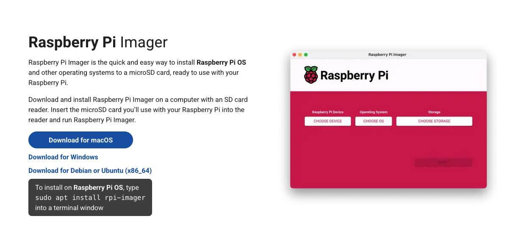
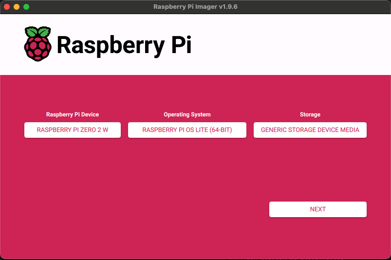
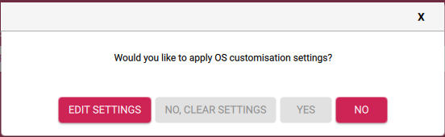
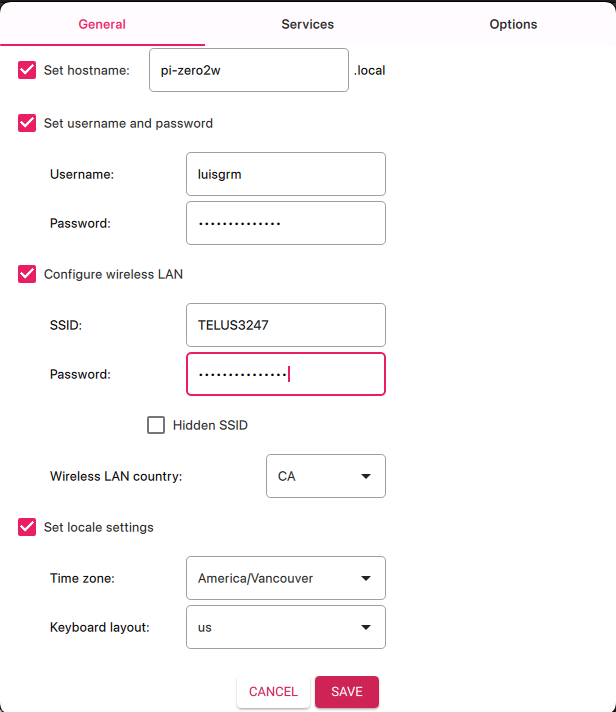
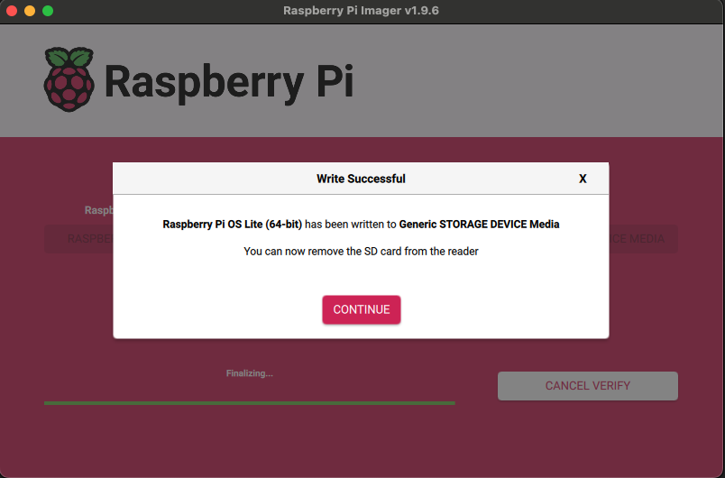
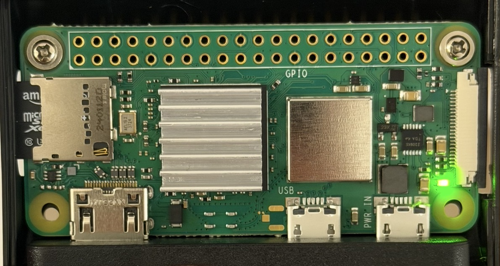
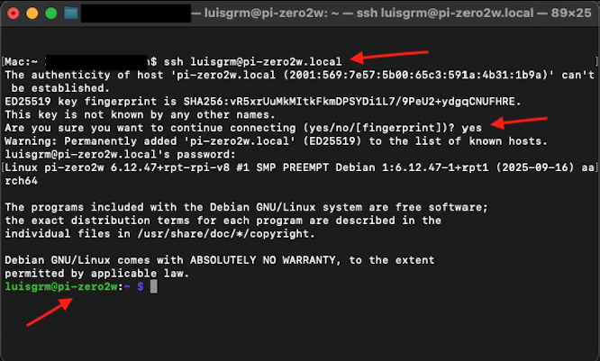

# 01 — Raspberry Pi OS Installation

## Overview

In this section, you will prepare the microSD card for the Raspberry Pi Zero 2 W by downloading Raspberry Pi OS Lite, flashing it using Raspberry Pi Imager, configuring advanced options (hostname, user account, Wi-Fi, SSH, and regional settings), and performing the first boot.

This ensures the Pi is fully ready for Pi-hole installation later on.

---

## Downloading Raspberry Pi Imager

Raspberry Pi Imager is the official tool used to download and flash Raspberry Pi OS.

1. Navigate to:  
   - https://www.raspberrypi.com/software/
2. Download the version of Raspberry Pi Imager for macOS.
3. Install it by dragging the `Raspberry Pi Imager` file into your Applications folder.



---

## Flashing Raspberry Pi OS Lite (64-bit Preferred)

1. Open **Raspberry Pi Imager**.
2. Select:
   - **OS** → Raspberry Pi OS Lite (64-bit)
   - **Storage** → Your microSD card
3. Click **Next**.
4. When the prompt appears asking:
   **“Would you like to apply OS customisation settings?”**
   click **EDIT SETTINGS** to open the advanced configuration menu.





---

## Using Advanced Options in Raspberry Pi Imager

The advanced settings allow you to preconfigure everything the Pi needs on first boot.

### Set Hostname

Example:

```plaintext
pi-zero2w
```

### Set Username and Password

In the Raspberry Pi Imager advanced options, enable “Set username and password” and configure:
  - Username: `luisgrm` (in my case)
  - Password: (Choose a secure password of your choice)

This ensures your Raspberry Pi uses your personal user account for SSH access. When a custom user is set, the default `pi` account is disabled automatically.

### Configure Wi-Fi

Fill in:

- SSID (Case Sensitive) 
- Password  
- Wi-Fi country (important for Wi-Fi to work)

### Regional Settings

Configure:

- Language
- Timezone  
- Keyboard layout

### Enable SSH

On the "Services" tab, select:

- **Enable SSH**
- Choose password or public key authentication



After setting the hostname, user account, Wi-Fi, regional settings, and SSH, click **SAVE**.

You’ll be prompted to apply these customisation settings → choose **YES**.

Finally, confirm the warning that **all existing data on the microSD card will be erased**, then wait for the flashing process to complete.

Once the flashing and verification process is complete, you will see a confirmation message:



You can now safely remove the microSD card from the reader.

---

## First Boot Overview

Insert the microSD card into the Raspberry Pi Zero 2 W and connect the **PWR IN** micro-USB port to your power supply.  

The Pi should power on immediately.

### Expected LED Indicators

- **Steady green LED** → System is booting successfully  
- **Flashing activity** → System is expanding filesystem and starting services  
- No LED at all → Check power supply or SD card seating



---

## First SSH Session

Once the Pi connects to Wi-Fi, your Mac can SSH into it using the hostname you configured:

```bash
ssh luisgrm@pi-zero2w.local
```

> ⚠️ Make sure your Mac and the Raspberry Pi are on the same Wi-Fi network.

If prompted to trust the fingerprint, type **yes**.



---

## Checkpoint

By the end of this section, your Raspberry Pi Zero 2 W should have:

- Raspberry Pi OS Lite (64-bit) installed  
- Hostname set
- Username and password set
- Regional settings applied
- Wi-Fi configured
- SSH enabled 
- Successful first boot completed

Your device is now fully ready for **[02-network-configuration.md](02-network-configuration.md)**.