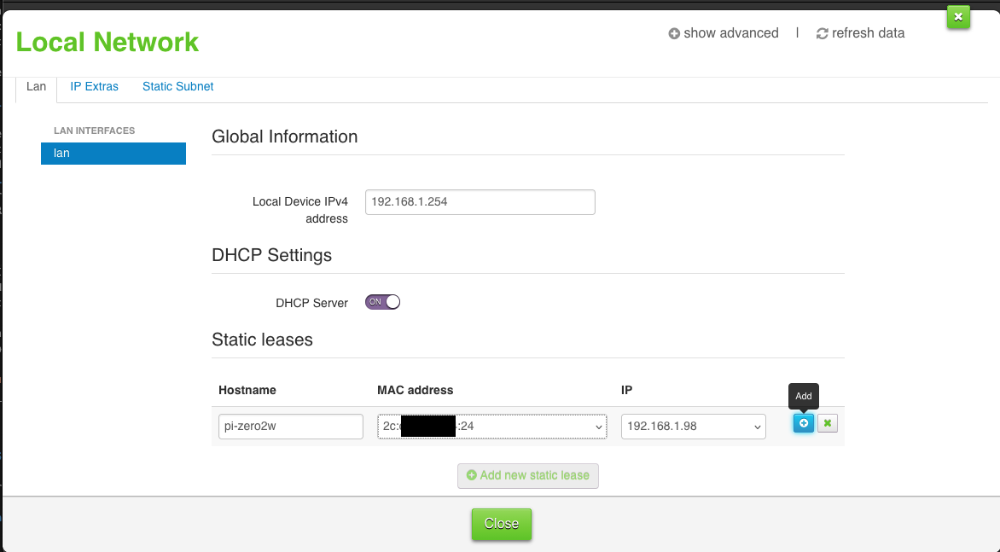
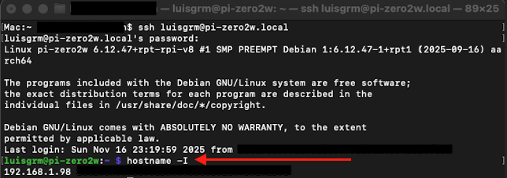
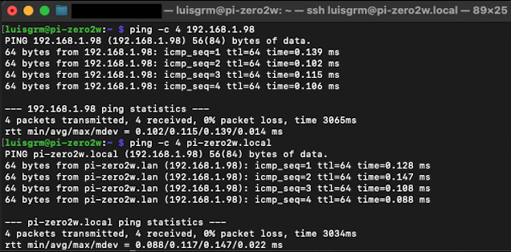
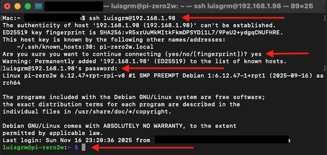

# 02 — Network Configuration

## Overview

In this section, you will assign a static DHCP lease to your Raspberry Pi Zero 2 W from your router’s admin panel and verify that the Pi is reachable using both its hostname (`pi-zero2w.local`) and its assigned IP address (`192.168.1.98`).

You will also confirm SSH access using the static IP to ensure a stable connection for the upcoming Pi-hole installation.

---

## Assigning a Static DHCP Lease

Instead of configuring a static IP directly in the Raspberry Pi, the most reliable method is to set a **DHCP reservation** in your router. This ensures:

- The Pi always receives the same IP (`192.168.1.98`)
- Centralized management
    - The router controls IP assignment, eliminating the need to manually configure or maintain static IP settings inside the device
- No IP conflicts on the network  
- Pi-hole’s DNS service remains stable  

### Steps (generalized):

1. Open your router’s admin page
    - If you don’t know the router’s IP address, check the sticker on your router or contact your ISP’s technical support.
2. Navigate to **LAN**, **DHCP Reservation**, or **Static Leases**
3. Obtain the current IP and MAC address:
    - Run on the Raspberry Pi: 
    ```bash 
    ifconfig
    ``` 
    - Under wlan0, locate:
        - `inet` → Current IP address  
        - `ether` → MAC address 
4. Enter the Pi’s MAC address into the router interface.
5. Assign the static IP:  
   `192.168.1.98`
6. Save the settings in the router
7. **Reboot the Raspberry Pi** to apply the new static lease.



---

## Verifying the Static IP Assignment

After your Raspberry Pi reboots, confirm it received the correct IP:

### Check the local IP address from the Pi:

```bash
hostname -I
```

You should see:

```plaintext
192.168.1.98
```



---

## Connectivity Tests

### Ping the Pi using the static IP

From your macOS terminal:

```bash
ping -c 4 192.168.1.98
```

This confirms the Pi is reachable over the network using its reserved IP.

### Ping the Pi using its hostname

```bash
ping -c 4 pi-zero2w.local
```

This confirms that hostname resolution is functioning properly.



---

## SSH Confirmation (Using Static IP Only)

Now that the Raspberry Pi has a stable IP address, connect to it using SSH:

```bash
ssh luisgrm@192.168.1.98
```

> ⚠️ You may be prompted again to confirm the SSH fingerprint. Type **yes** and press Enter, then enter your password.



A successful login confirms that SSH is also working correctly using the static IP address.

---

## Checkpoint

By the end of this section, your Raspberry Pi Zero 2 W should have:

- A static IP address assigned (`192.168.1.98`)
- Successful ping responses using static IP
- Successful ping responses using hostname (`pi-zero2w.local`)
- Successful SSH access using the static IP

Your device is now fully ready for **[03-pihole-installation.md](03-pihole-installation.md)**.