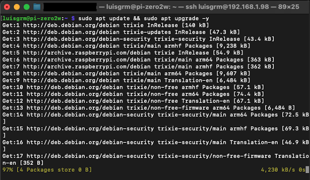
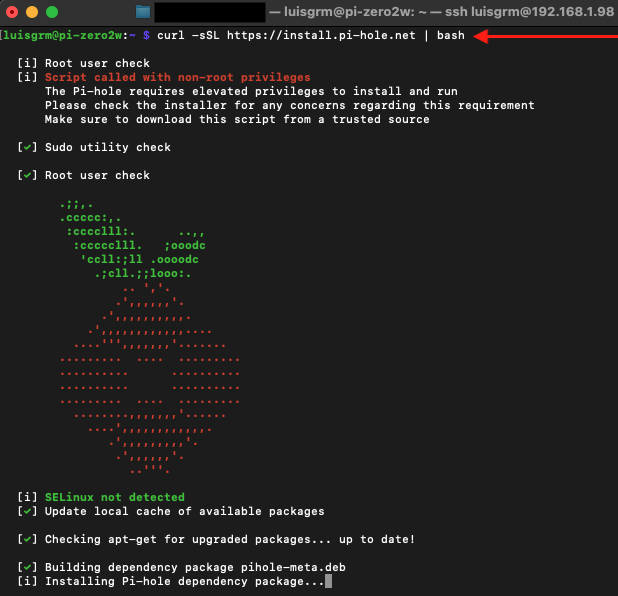
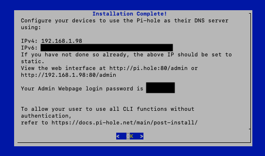
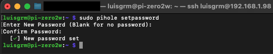
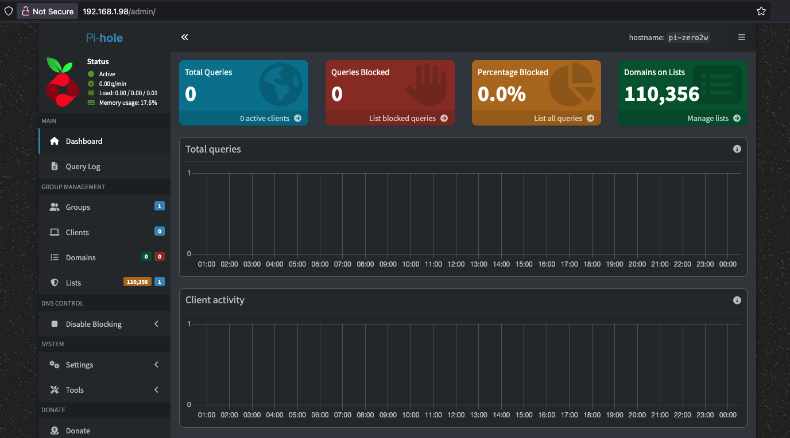
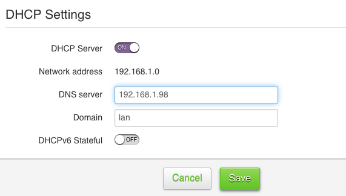
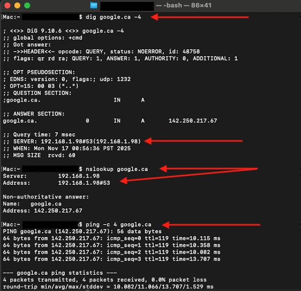
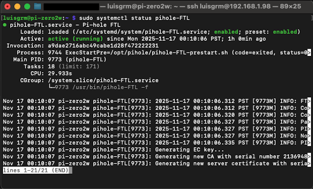

# 03 — Pi-hole Installation

## Overview

In this section, you will install **Pi-hole** on your Raspberry Pi Zero 2 W, configure its DNS settings, complete the guided installer, and assign the Pi as the **primary DNS server** for your entire network.  
Once this is done, you will verify that DNS resolution and general Internet access continue to work correctly.

By the end of this document, Pi-hole will be fully installed and reachable through its web interface.

---

## Updating Raspberry Pi OS

Before installing Pi-hole, ensure your system is fully updated:

```bash
sudo apt update && sudo apt upgrade -y
```

This ensures all dependencies are current and reduces installation issues.



---

## Installing Pi-hole (Official Method)

Pi-hole provides an automated installation script. Run:

```bash
curl -sSL https://install.pi-hole.net | bash
```

This launches the interactive installer.



---

## Guided Installer Steps

During installation, Pi-hole will prompt for several configuration steps. The recommended responses are provided below so the setup matches the rest of this documentation.

### 1. Welcome / Automated Installer  
Press **OK**.

### 2. Static IP Address Check  
If your Pi already has its reserved IP (`192.168.1.98`), select **Continue**.

### 3. Upstream DNS Provider  
Select a privacy-focused DNS provider:  
- **Cloudflare (1.1.1.1)**
    - No logging
    - Security protections

### 4. Blocklists  
Default list:  
- **StevenBlack’s Unified Host List** → **YES**

### 5. Query Logging Options 
Choose:  
- **Enabled → Show Everything**  

This enables full visibility of DNS activity in the Pi-hole dashboard. You can adjust this level later at any time.

### 6. Installation Completes  
After all components are installed (DNS service, FTL engine, web interface), Pi-hole shows a final summary screen with your DNS IP addresses and admin panel URLs.



---

## Setting the Admin Password

Although the installer displays a default admin password, it is best practice to replace it with a secure one of your own because this controls access to the web admin page.

- Set a custom password using:
```bash
sudo pihole setpassword
```

> ⚠️ For security reasons, always use a password you control instead of relying on automatically generated ones.



---

## Accessing the Pi-hole Web Interface

You can now reach the dashboard at:

```plaintext
http://pi.hole:80/admin

or

http://192.168.1.98:80/admin
```



At this stage, Pi-hole is fully installed but not yet filtering DNS traffic.
Your devices are still using your router’s default DNS settings, so no queries will appear on the dashboard.  

To activate Pi-hole’s filtering, you must now assign the Raspberry Pi as the primary DNS server in your router settings.

---

## Assigning Pi-hole as the Network DNS (Router Settings)

To enable Pi-hole for your whole apartment network **and allow it to actually perform DNS filtering**, you must configure your router to use the Raspberry Pi as the primary DNS server. Without this step, devices will keep using your ISP’s DNS instead of Pi-hole, and no filtering will occur.

To use the Raspberry Pi as the primary DNS server:

1. Open your router’s admin page  
2. Find the **LAN** or **DNS Settings** section  
3. Set the primary DNS server to your Pi-hole IP:
```plaintext
192.168.1.98
```
4. Save the settings  
5. Reboot the router **or** wait for DHCP renewals  
6. Reconnect one of your devices to Wi-Fi



**Why now?**  
At this stage Pi-hole is fully installed and stable. Setting the DNS earlier may cause DNS failures during installation, which is why the router is updated *after* Pi-hole is ready.

---

## Testing Internet & DNS After Router Update

### 1. Test DNS resolution on macOS

```bash
dig google.ca -4
```

A valid DNS response confirms that DNS resolution is working normally.

### 2. Confirm that Pi-hole is actually answering DNS queries

```bash
nslookup google.ca
```

Expected output:

```plaintext
Server: 192.168.1.98
Address: 192.168.1.98#53
```

This verifies that your Mac is now using Pi-hole as its DNS server.

### 3. Test general Internet connectivity

```bash
ping -c 4 google.ca
```

If all tests succeed, Pi-hole is functioning as the network DNS server.



---

## Verifying the FTL (DNS Engine) Service

Pi-hole’s DNS engine is called **FTL (Faster Than Light)**. It must be running for Pi-hole to answer DNS queries. 
Confirm that it is running:

```bash
sudo systemctl status pihole-FTL
```

You should see:

- **active (running)** → correct  
- **inactive** or **failed** → troubleshoot using **[06-troubleshooting.md](06-troubleshooting.md)**



---

## Checkpoint

By the end of this section, your Raspberry Pi Zero 2 W should have:

- Pi-hole fully installed  
- Admin password set  
- Upstream DNS configured (Cloudflare recommended)  
- Blocklists enabled  
- Router configured to use Pi-hole (`192.168.1.98`) as DNS  
- Verified DNS resolution via Pi-hole  
- Verified general Internet connectivity  
- FTL DNS engine running correctly  

Your device is now ready for **[04-web-interface-and-usage.md](04-web-interface-and-usage.md)**.