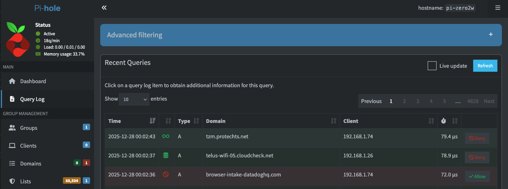
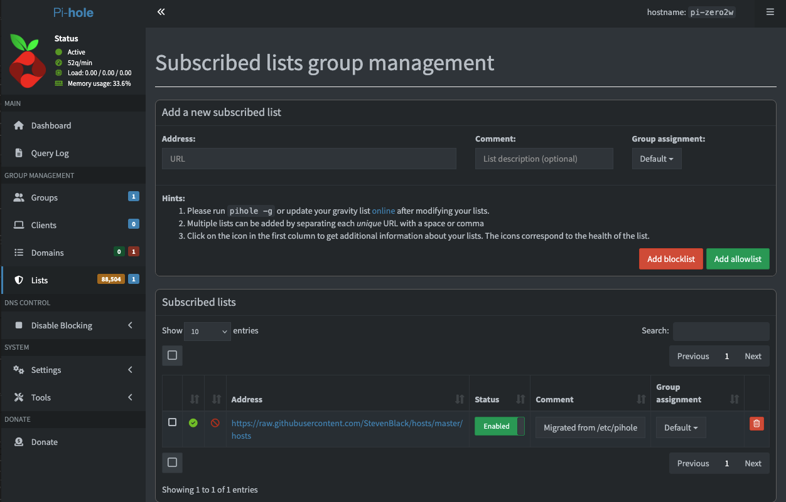
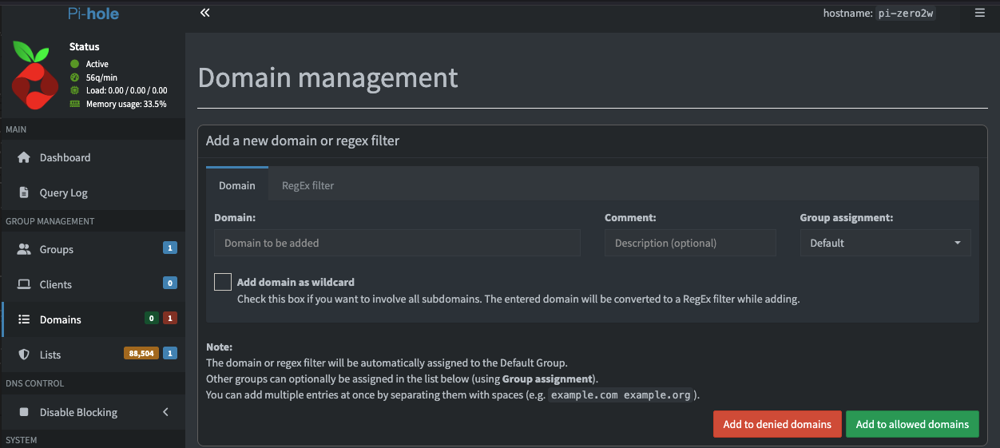
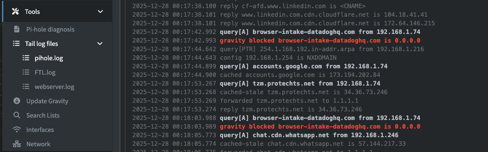

# 04 — Pi-hole Web Interface & Usage

## Overview

With Pi-hole fully installed and your router configured to use it as the primary DNS server, you can now begin exploring and managing the Pi-hole web interface.  

This section explains the dashboard, query logs, blocklists, tools, and the most common tasks you will perform when using Pi-hole daily.

---

## Understanding the Dashboard

Once logged in, you will see a real-time summary of your network’s DNS activity and filtering behavior.

### Key Metrics

#### **1. Total Queries**
Total number of DNS requests from all devices on your network.

#### **2. Queries Blocked**
The number of DNS requests blocked due to ads, trackers, or blocklist entries.

#### **3. Percentage Blocked**
Shows how much of your traffic Pi-hole is filtering.  
A typical home network often ranges between **5%–20%**.

#### **4. Clients**
How many devices contacted Pi-hole today.

---

## Choosing an Upstream DNS Provider

The upstream DNS provider handles queries that Pi-hole does not block.  
You can change this anytime under:

**Settings → DNS**

Recommended privacy-friendly options:

- **Cloudflare (1.1.1.1 and 1.0.0.1)**
- **Quad9 (9.9.9.9 and 149.112.112.112)**

Avoid “free” DNS providers known for logging.

---

## Viewing Query Logs

Pi-hole keeps a detailed record of DNS requests.

### Real-Time Query Log

Navigate to:

**Query Log**

You will see:

- The requesting device
- The domain queried
- Whether the request was forwarded, blocked, or cached
- The list or rule responsible for blocking it (if blocked)



Use the filter tools to select:

- Only blocked queries  
- Only allowed queries  
- Only specific devices  

---

## Managing Lists

Pi-hole blocks domains using community-maintained **blocklists** and allows specific domains using **allowlists**.

To manage them, go to:

**Lists**

### Adding a New Blocklist or Allowlist

1. Paste a list URL into the **Address** field (example below).
2. (Optional) Add a description in the **Comment** field.
3. Click **Add blocklist** or **Add allowlist**.

Example list URL:

```plaintext
https://raw.githubusercontent.com/StevenBlack/hosts/master/hosts
```

⚠️ After adding or removing lists, update Pi-hole’s gravity database so changes take effect:

```bash
sudo pihole -g
```



---

## Whitelisting Domains

Some services (e.g., YouTube, streaming apps, bank login pages) may break when necessary domains are blocked.

### How to Whitelist

Go to:

**Domains**

Choose **Whitelist**, then add the domain:

```plaintext
googlevideo.com
```

or

```plaintext
api.netflix.com
```



> **Tip:** Always whitelist the bare domain first. Only whitelist subdomains if still necessary.

---

## Regex Blocking (Advanced)

Regex filtering allows powerful pattern-based blocking.  
Example: block all TikTok tracking domains:

```plaintext
(^|\.)tiktokcdn\.com$
```

Add under:

**Domains → RegEx filter**

---

## Using Tools → Tail pihole.log (Real-Time Monitoring)

Pi-hole includes a live DNS monitor that lets you watch DNS activity as it happens.

Navigate to:

**Tools → Tail log files → pihole.log**

You will see new DNS queries appear in real time. The log output is formatted by message type rather than a strict color legend (colors may vary depending on your browser/theme), but you can still clearly identify key events such as:

- **Queries** (domains devices are requesting)
- **Forwarded requests** (queries Pi-hole sends upstream)
- **Replies** (answers returned to the client)
- **Blocked entries** (shown as “gravity blocked …”)

This is especially useful when troubleshooting why a website/app is not working, since you can immediately see what domains are being requested and whether Pi-hole is blocking them.



---

## Example Common Tasks

### Block Ads Network-Wide

1. Add new blocklists  
2. Update gravity  
3. Confirm blocking in the Query Log  

### Whitelist a Service (e.g., YouTube, Netflix)

Sometimes streaming apps require specific domains.  
Procedure:

1. Attempt to use the app  
2. Open **Query Log** and filter by the device  
3. Look for domains marked **blocked**  
4. Whitelist only domains essential for the service to function  

### Temporarily Disable Pi-hole

Useful for troubleshooting.

From the dashboard, click: **Disable → 5 minutes** (or custom time)

---

## Checkpoint

By the end of this section, you should fully understand:

- How to navigate the Pi-hole web interface  
- How to read dashboard metrics  
- How to inspect DNS activity in the Query Log  
- How to update blocklists  
- How to whitelist and blacklist domains  
- How to monitor live DNS events  

Your Pi-hole is now actively filtering ads and telemetry across your entire apartment network.

Next: **[05-maintenance-and-updates.md](05-maintenance-and-updates.md)**