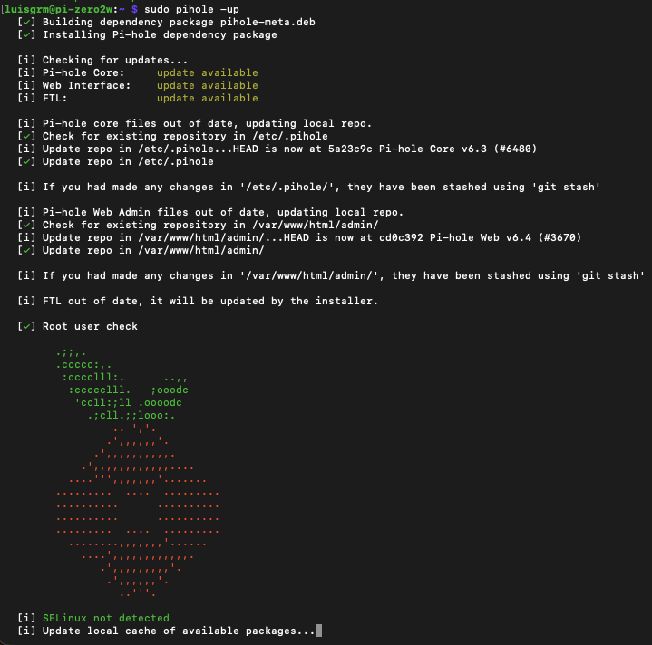
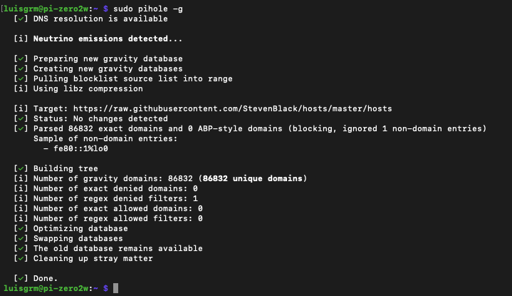
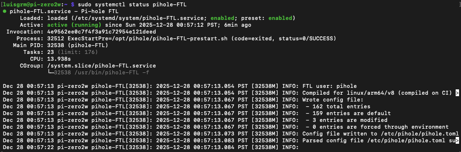

# 05 — Maintenance and Updates

## Overview

Once Pi-hole is deployed and actively filtering DNS traffic, regular maintenance ensures continued reliability, security, and optimal performance.

In this section, you will learn how to:
- Update Raspberry Pi OS safely
- Update Pi-hole and its blocklists
- Restart Pi-hole services when needed
- Monitor system health and resource usage
- Perform basic maintenance tasks without disrupting DNS service

These tasks are safe to perform on a running system and should be done periodically.

---

## Updating Raspberry Pi OS

Keeping the operating system up to date ensures security patches and bug fixes are applied.

Run the following commands on the Raspberry Pi:

```bash
sudo apt update && sudo apt upgrade -y
```

If kernel or core packages are updated, a reboot may be required.

To reboot safely:

```bash
sudo reboot
```

> ⚠️ A reboot will temporarily interrupt DNS service. Perform this during low-usage hours if possible.

---

## Updating Pi-hole

Pi-hole updates independently from the OS.

To update Pi-hole:

```bash
sudo pihole -up
```

This will:
- Update Pi-hole core files
- Update the web interface
- Update the FTL (DNS engine)
- Preserve your existing configuration



---

## Updating Blocklists (Gravity)

Pi-hole uses a database called **Gravity** to manage blocklists.

To manually refresh blocklists:

```bash
sudo pihole -g
```

This fetches:
- Updated blocklists
- Newly added allowlists
- Changes from group assignments



### When to Update Gravity
- After adding or removing blocklists
- After changing allowlists or groups
- Periodically (weekly or monthly)

---

## Restarting Pi-hole Services

If DNS resolution stops working or changes do not apply immediately, restarting services is usually sufficient.

Restart Pi-hole DNS (FTL):

```bash
sudo systemctl restart pihole-FTL
```

Restart the web interface:

```bash
sudo systemctl restart lighttpd
```

This does **not** require a full system reboot.

---

## Checking Pi-hole Service Status

Verify that Pi-hole’s DNS engine is running:

```bash
sudo systemctl status pihole-FTL
```

Expected state:

- **Active (running)** → normal operation
- **Inactive / failed** → requires troubleshooting



---

## Monitoring System Health

### Check Disk Usage

```bash
df -h
```

Ensure the root filesystem is not near capacity.

### Check Memory Usage

```bash
free -h
```

Pi-hole typically uses very little memory and CPU.

### Check CPU Load

```bash
uptime
```

Low load averages indicate healthy operation.

---

## Clearing Query Logs (Optional)

Over time, query logs may grow large.

To flush the DNS log:

```bash
pihole flush
```

This clears historical queries but does **not** affect filtering behavior.

---

## Best Practices

- Update Pi-hole monthly or when notified
- Update blocklists after list changes
- Reboot only when necessary
- Keep SSH access secured
- Avoid frequent power interruptions

---

## Checkpoint

By the end of this section, you should be able to:

- Safely update Raspberry Pi OS
- Update Pi-hole without losing configuration
- Refresh blocklists (Gravity)
- Restart Pi-hole services when needed
- Monitor system health and performance

Your Pi-hole deployment is now stable, maintainable, and production-ready.

Next: **[06-troubleshooting.md](06-troubleshooting.md)**. Diagnosing and fixing common issues.